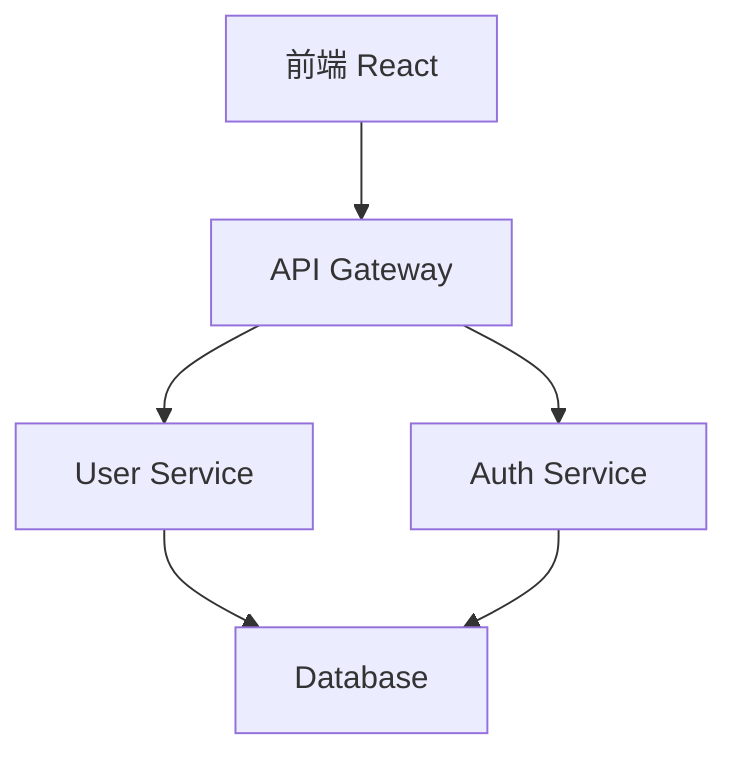

# Cursor 獨有功能詳解

## 🚀 為什麼選擇 Cursor？

Cursor 不只是另一個程式碼編輯器，它是專門為 AI 時代設計的開發工具，提供了許多 VS Code 和其他編輯器無法比擬的獨特功能。

## 🔥 核心獨有功能

### 1. Codebase Intelligence（程式碼庫智慧）

#### 🧠 整專案理解能力
Cursor 可以分析和理解整個程式碼庫，而不僅僅是單一檔案：

```
專案結構感知：
├── src/
│   ├── components/     ← AI 理解這是元件資料夾
│   ├── services/       ← AI 知道這是服務層
│   ├── utils/          ← AI 識別工具函數
│   └── types/          ← AI 理解型別定義
```

**實際應用範例：**
- 詢問：「這個專案使用什麼架構模式？」
- Cursor 會分析整個專案結構並給出准確答案
- 建議符合專案風格的程式碼

#### 🔗 跨檔案智慧重構
```javascript
// 在 UserService.js 中修改函數簽名
class UserService {
  // 舊版本
  getUser(id) { ... }
  
  // 新版本（透過 Cursor AI 修改）
  async getUser(id, includeProfile = false) { ... }
}
```

Cursor 會自動：
- 識別所有使用該函數的地方
- 建議更新所有呼叫點
- 確保型別一致性

### 2. Advanced @-mentions（進階程式碼引用）

#### 📁 檔案和資料夾引用
```
@filename.js           - 引用特定檔案
@components/          - 引用整個資料夾
@src/utils/helpers.js - 引用相對路徑檔案
@../config/           - 引用上層資料夾
```

#### 🔄 Git 變更引用
```
@git                  - 引用最近的 Git 變更
@git:main             - 引用 main 分支的差異
@git:3 commits        - 引用最近 3 次提交
```

#### 📚 文件引用
```
@README.md            - 引用專案說明
@docs/api.md          - 引用 API 文件
@package.json         - 引用專案配置
```

**實用範例：**
```
問題：「根據 @package.json 的依賴項，@README.md 的說明，
      以及 @src/components/ 的現有元件，
      建議一個新的登入頁面實作方案」
```

### 3. Background Agent（背景代理）

#### 🚀 什麼是 Background Agent？
Background Agent 是 Cursor 1.0+ 版本的強大功能，可以在遠端環境中執行複雜的編程任務：

**啟動方式：**
- 快捷鍵：`Ctrl+E`
- 或在聊天視窗點擊雲朵圖示

#### 🌟 Background Agent 特色功能

**1. 遠端執行環境**
- 在安全的雲端環境中執行
- 不占用本地計算資源
- 支援長時間運行的任務

**2. 平行任務處理**
- 同時執行多個代理
- 互不干擾的獨立任務
- 實時狀態監控

**3. 完整專案開發**
```
要求：「建立一個完整的電商網站，包含：
- 前端 React 應用程式
- 後端 Node.js API
- 資料庫設計和遷移
- 用戶認證系統
- 付款整合
- 測試套件」
```

Background Agent 會：
- 分析需求並制定計劃
- 建立完整的專案結構
- 實作所有功能模組
- 設定開發和部署環境
- 撰寫文件和測試

**4. 智慧任務分解**
```
要求：「重構這個 50,000 行的 legacy 程式碼庫，
      使其符合現代最佳實踐」
```

Background Agent 會：
- 分析現有程式碼架構
- 制定重構策略
- 分步驟執行重構
- 確保功能不受影響
- 生成遷移報告

**5. 與外部服務整合**
- GitHub PR 自動建立
- Slack 通知整合（支援 @Cursor 提及）
- 專案管理工具同步

**6. Slack 深度整合**
```
在 Slack 頻道中提及 @Cursor：
"@Cursor 請幫我建立一個使用者登入功能，
包含前端表單和後端驗證"
```

Background Agent 會：
- 讀取整個 Slack 對話串
- 理解團隊討論的上下文
- 自動建立 GitHub PR
- 在 Slack 中回報進度

### 4. BugBot（自動程式碼審查）

#### 🤖 智慧程式碼審查
BugBot 是 Cursor 1.0+ 的革命性功能，可自動審查 Pull Request：

**功能特色：**
- 自動偵測潛在 bug 和問題
- 在 GitHub PR 中留下評論
- 一鍵修復（"Fix in Cursor" 按鈕）
- 整合到開發工作流程

**使用場景：**
```javascript
// BugBot 會自動偵測這類問題：
function getUserData(userId) {
  const user = users.find(u => u.id === userId);
  return user.name; // 潛在的 null reference 錯誤
}

// BugBot 建議：
function getUserData(userId) {
  const user = users.find(u => u.id === userId);
  return user?.name || 'Unknown User'; // 安全的存取方式
}
```

### 5. Memories（AI 記憶功能）

#### 🧠 專案級 AI 記憶
Cursor 可以記住專案的重要資訊和開發模式：

**記憶內容：**
- 專案架構偏好
- 程式碼風格選擇
- 常用解決方案
- 團隊開發習慣

**啟用方式：**
- 前往 Settings → Rules → 啟用 Memories
- AI 會自動學習和記憶專案特性

**實際應用：**
```javascript
// AI 記住你的錯誤處理模式
const handleApiCall = async () => {
  try {
    const response = await api.fetchData();
    // Cursor 記住你總是先驗證 response
    if (!response.success) {
      throw new Error(response.message);
    }
    return response.data;
  } catch (error) {
    // 記住你的錯誤處理習慣
    logger.error('API call failed:', error);
    showNotification('操作失敗，請稍後再試', 'error');
    return null;
  }
};
```

### 6. Enhanced Chat Features（增強聊天功能）

#### 📊 視覺化支援
Cursor 聊天現在可以直接渲染：

**Mermaid 圖表：**
```
要求：「畫出我們系統的架構圖」

Cursor 會生成並顯示：

```

**Markdown 表格：**
```
要求：「比較不同的狀態管理方案」

Cursor 會生成並顯示表格：
| 方案 | 學習曲線 | 效能 | 生態系統 |
|------|----------|------|----------|
| Redux | 高 | 優秀 | 豐富 |
| Zustand | 低 | 優秀 | 適中 |
| Recoil | 中 | 良好 | 新興 |
```

#### 🔄 聊天分頁功能
- 同時進行多個對話（`Ctrl+T` 新分頁）
- 各分頁獨立上下文
- 橙色點標示需要回應的分頁

### 7. MCP Integration（MCP 整合）

#### 🔌 一鍵安裝 MCP 伺服器
Model Context Protocol (MCP) 讓 Cursor 可以連接外部工具：

**官方支援的 MCP 工具：**
- Database 連接器
- File system 整合
- Web search 功能
- Git 進階操作
- Cloud services 整合

**OAuth 支援：**
- 一鍵授權外部服務
- 安全的認證流程
- 團隊共享配置

### 8. Advanced Models Support（進階模型支援）

#### 🎯 Max Mode
針對複雜任務提供最強大的 AI 能力：

**適用場景：**
- 大型重構專案
- 複雜演算法實作
- 架構設計決策
- 效能優化分析

**支援模型：**
- GPT-4.1, o3, o4-mini
- Gemini 2.5 Pro, 2.5 Flash  
- Grok 3, Grok 3 Mini
- Claude Sonnet 3.5

### 9. Intelligent Tab Completion（智慧 Tab 補全）

#### 🔮 上下文感知補全
Cursor 的 Tab 補全不只是語法提示：

```javascript
// 在 React 元件中
const UserProfile = ({ user }) => {
  const [isLoading, setIsLoading] = useState(false);
  
  // 輸入 "const handle" 然後按 Tab
  // Cursor 會建議：
  const handleSubmit = async (e) => {
    e.preventDefault();
    setIsLoading(true);
    try {
      // 根據專案模式自動生成邏輯
    } catch (error) {
      console.error(error);
    } finally {
      setIsLoading(false);
    }
  };
}
```

#### 🎯 專案模式學習
Cursor 會學習你的專案模式：

```javascript
// 如果專案使用特定的錯誤處理模式
try {
  await apiCall();
} catch (error) {
  // Cursor 學到你習慣這樣處理錯誤
  toast.error(error.message);
  logError(error);
}

// 之後在其他地方，它會建議相同的模式
```

### 5. Smart Terminal Integration（智慧終端整合）

#### 💡 指令建議
當終端出現錯誤時，Cursor 可以：

```powershell
# 錯誤訊息
npm ERR! Missing script: "build"

# Cursor 建議
建議新增到 package.json：
{
  "scripts": {
    "build": "vite build"
  }
}

# 或建議直接執行
npm run dev
```

#### 🔧 自動偵錯
```powershell
# Git 錯誤
error: failed to push some refs to 'origin'

# Cursor 分析並建議
建議執行：
git pull --rebase origin main
git push origin feature-branch
```

### 6. Context-Aware Chat（上下文感知聊天）

#### 🧭 自動載入相關檔案
當你提問時，Cursor 會自動：
- 分析問題內容
- 載入相關檔案到上下文
- 提供精準的解答

```
問題：「為什麼我的登入功能不工作？」

Cursor 自動載入：
✓ LoginComponent.jsx
✓ authService.js  
✓ userReducer.js
✓ api/auth.js
✓ 相關測試檔案

然後提供具體的問題診斷
```

#### 🎯 技術選型建議
```
問題：「我該選擇 Redux 還是 Zustand 來管理狀態？」

Cursor 會分析：
- 專案規模
- 現有依賴
- 團隊技術棧
- 效能需求

提供客製化建議
```

## 🎨 進階使用技巧

### 1. 組合使用多個功能

**範例：重構現有功能**
```
步驟 1：使用 @git 查看最近變更
步驟 2：使用 Background Agent 要求重構
步驟 3：使用 @-mentions 引用相關檔案
步驟 4：讓 AI 分析整個專案影響
```

### 2. 自訂 AI 行為

#### .cursorrules 檔案
```
# 在專案根目錄建立 .cursorrules
You are an expert in React and TypeScript.

Code Style:
- Use functional components with hooks
- Prefer const assertions for better type inference
- Use meaningful variable names
- Add JSDoc comments for complex functions

Architecture:
- Follow clean architecture principles
- Separate business logic from UI components
- Use custom hooks for state management
```

#### Cursor Rules（.cursor/rules/）
Cursor Rules 是 Cursor 的進階規則系統，比 .cursorrules 更強大：

**建立 Cursor Rules：**
1. 建立 `.cursor/rules/` 資料夾
2. 建立 `.mdc` 檔案（Markdown + Cursor 擴展）
3. 使用特殊語法引用專案檔案

**範例：專案架構規則**
```markdown
# 建立 .cursor/rules/architecture.mdc

# 專案架構指南

## 主要檔案結構
- 入口點：[src/main.tsx](mdc:src/main.tsx)
- 路由配置：[src/router/index.tsx](mdc:src/router/index.tsx)
- 全域樣式：[src/styles/globals.css](mdc:src/styles/globals.css)

## 元件規範
元件應該放在 [src/components/](mdc:src/components/) 目錄下，
參考範例：[src/components/Button/Button.tsx](mdc:src/components/Button/Button.tsx)

## 狀態管理
使用 Zustand，店舖定義在 [src/stores/](mdc:src/stores/) 目錄
```

**範例：編碼規範規則**
```markdown
# 建立 .cursor/rules/coding-standards.mdc

# 編碼規範

## TypeScript 規範
參考 [tsconfig.json](mdc:tsconfig.json) 設定，嚴格遵循型別定義

## 測試規範
每個元件都應該有對應測試檔案，
參考範例：[src/components/Button/Button.test.tsx](mdc:src/components/Button/Button.test.tsx)

## 命名規範
- 元件使用 PascalCase
- 檔案名稱與元件名稱相同
- 測試檔案加上 .test.tsx 後綴
```

**使用 Cursor Rules：**
- AI 會自動讀取這些規則
- 在聊天中可以引用：「根據我們的架構規則...」
- 程式碼生成時會自動遵循規則

### 3. 團隊協作最佳化

#### 共享上下文
```
# 在聊天中建立團隊上下文
"根據我們的 @docs/coding-standards.md 
和 @.cursorrules 檔案，
檢查這個 PR 是否符合團隊規範"
```

## 📊 效能比較

| 功能 | VS Code + Copilot | Cursor |
|------|-------------------|--------|
| 單檔案補全 | ✅ 優秀 | ✅ 優秀 |
| 聊天介面 | ❌ 需要擴充功能 | ✅ 內建 + 分頁 |
| 跨檔案理解 | ❌ 有限 | ✅ 優秀 |
| 專案級重構 | ❌ 不支援 | ✅ 優秀 |
| 背景任務執行 | ❌ 不支援 | ✅ Background Agent |
| 自動程式碼審查 | ❌ 不支援 | ✅ BugBot |
| AI 記憶功能 | ❌ 不支援 | ✅ Memories |
| 視覺化渲染 | ❌ 不支援 | ✅ Mermaid + 表格 |
| 外部工具整合 | ❌ 有限 | ✅ MCP 生態系統 |
| Slack 深度整合 | ❌ 不支援 | ✅ @Cursor 提及 |
| 多模型支援 | ❌ 僅 GPT | ✅ 全模型 + Max Mode |
| 上下文聊天 | ❌ 有限 | ✅ 智慧載入 |
| 學習專案模式 | ❌ 有限 | ✅ 主動學習 |

## 🚀 實際開發場景

### 場景 1：新專案啟動
```
要求：「根據 @package.json 建立一個現代化的 React 專案結構，
      包含 TypeScript、Tailwind CSS、測試設定」

Cursor 會：
1. 分析依賴項
2. 建立標準資料夾結構
3. 配置開發工具
4. 建立範例元件和測試
```

### 場景 2：效能優化
```
要求：「分析這個專案的效能瓶頸並提出優化方案」

Cursor 會：
1. 掃描整個程式碼庫
2. 識別效能問題
3. 提出具體優化建議
4. 可選擇性自動實作優化
```

### 場景 3：Bug 修復
```
錯誤：「TypeError: Cannot read property 'name' of undefined」

Cursor 會：
1. 追蹤錯誤來源
2. 分析相關程式碼路徑
3. 建議防禦性程式設計
4. 提供測試案例
```

## 💡 最佳實踐建議

### 1. 善用 @-mentions
- 經常引用相關檔案提供上下文
- 使用 @git 了解最近變更
- 引用文件檔案確保一致性

### 2. 善用 Background Agent
- 處理複雜的多檔案任務
- 進行大規模重構專案
- 自動化重複性工作

### 3. 培養 AI 協作習慣
- 提供清晰的需求描述
- 善用專案上下文
- 逐步迭代改進

### 4. 設定專案規範
- 建立 .cursorrules 檔案
- 維護清晰的文件
- 定期更新開發規範

---

**下一步：** 閱讀 [AI 協作技巧](./03-ai-collaboration.md) 了解如何最大化 Cursor 的 AI 功能。 